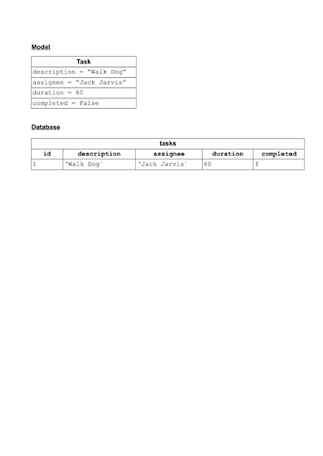

# Connecting to a Database

## Objectives

* Understand how Python talks to a database
* Know that an object maps to a row in the db table
* By the end of this lesson you should be able to create your own single model CRUD app (Python and SQL)

## Task Manager software

We are going to introduce this idea of persistence by creating software that tracks tasks. The end code has been provided so you can reference it as you read through this lesson. To run it, cd into the `code` directory and do the following:

```bash
# Terminal
sqlite3 db/task_manager.db < db/task_manager.sql 
```
This will create the database and table and populate it with 2 rows.

Then you can run the `console.py` file.

```bash
python3 console.py
```

Ultimately we want to be able to:

* Create new tasks
* Read/Find existing tasks
* Update existing tasks
* Delete existing tasks

Up until now most of this functionality would have been pretty hard to accomplish as we only had the computer's memory to use.

First of all though, we will setup our model and object - just like we have done many times before.

### Task Model

We have a `model` (another name for a class) and it's role will be to speak to the database. A Task has:

-  a description
-  the name of the person assigned to it
-  a duration
-  whether or not it has been completed (this will be False by default)

The Task class is located in the `models` directory

```python
# models/task.py

class Task:
    
    def __init__(self, description, assignee, duration, completed = False):
        self.description = description
        self.assignee = assignee
        self.duration = duration
        self.completed = completed
        
    def mark_complete(self):
        self.completed = True

```

## Adding a database

Great, now we want to add a database layer to our application. Each row in the database table will correspond to an instance of the Task class. 

### Mapping an instance to a table row



We want to be able to select all the rows from our tasks table.

We will:

* Import a library, `sqlite3`, which allows us to: 
  - Make a connection to a database 
  - Execute a prepared SQL statement on that database
* Create a function, let's call it 'select_all', but it could be called anything e.g. get_all etc.
* Write our SQL in our method and execute it


We want to differentiate between all our tasks, so what else might we add? An ID

```sql
-- db/task_manager.sql

DROP TABLE IF EXISTS tasks;

CREATE TABLE tasks (
  id INTEGER PRIMARY KEY AUTOINCREMENT,
  description VARCHAR,
  assignee VARCHAR,
  duration INT,
  completed BOOLEAN DEFAULT FALSE
);
```

### The SQLite3 library

We now want to be able to get our Python code to communicate with our database. We are going to use a library to help us with this. This library will handle connecting to the database and will execute SQL for us.

We are using a SQLite3 database so we need to use a library which has been written with this in mind. There are several libraries we could use but we are going to a library called [sqlite3](https://docs.python.org/3/library/sqlite3.html), which is the most popular. 

This library is already installed as part of our python3 installation so we can use it in our code to connect with our database and run SQL commands. Where shall we write this code? We could add methods to our `Task` class and run them there. That would be fine. But what if we wanted to change the database we were using, maybe one which does not use SQL. We would have to go in and change all the code in our `Task` class. More importantly, the responsibility of our `Task` class is to model a task, not to save tasks to the database. 

What we are going to do is add a layer of code, called a `repository` between our model and our database. This layer will be responsible for taking interacting with the database. This is what's known as a **design pattern** which is common pattern for designing software. We are using the **repository pattern**


As we have a different class for each model, we usually create a different repository for each model. In the **repositories** directory you'll see a file called **task_repository.py**

In this repository file we write the functions for the interactions with the database. These functions are all going to fall into the same pattern:

1) Make a connection to a database

2) Execute a [prepared SQL statement](https://en.wikipedia.org/wiki/Prepared_statement) on that database

3) Close the connection to the database

4) Return the results (if needed)

So it looks like there may be a bit of repeated code in our functions, especially regarding steps 1 and 3. Rather than having the same code repeated in the functions in our repository, we can move this common code out into a helper function into which we simply pass in the SQL we want to run and it will return the results. We can even use this helper function if we add further models and corresponding repositories.

### Creating a SQL Runner

We have a module to run our SQL, called `run_sql`. Since the code is in this file is purely for database interaction, we  place it in our `db` directory:

Have a look at `run_sql.py`. First of all we need to import the `sqlite3` library:

```python
# db/run_sql.py

import sqlite3

```

Our file is only going to contain two functions so we don't really need to create a class. It is going to be just a couple of functions which we can call. Therefore, it makes sense to make `run_sql` a module.


#### Creating our database connection

To connect to our database we use a function from the sqlite3 library called `connect`. This takes a string as a parameter. This string contains information about the database we want to connect to and is known as a _connection string_. This string usually contains the following information:

- the location of the machine which is hosting the database
- the name of the database
- the login details for the database (username and password)

In our case, the database is on our local machines and we don't need a username and password to log in so in this case we only need to give the name of the database we are connecting to.

To make our code easier to read, we are going to separate our code into two functions: one to deal with the connection to the database, and the other to execute our database queries.

Let's start with the function to connect to the database. We will call this `get_db`.

```python
# db/run_sql.py
import sqlite3

def get_db():
    
```

The first thing we want to do is to be able to access the `task_manager.db` file for our database. This should be in the `db` directory i.e. the same directory as the `run_sql.py` file. To do this we could simply do a `pwd` and paste in the full path to the `db` directory, but what if we move the code, or if someone pulls it down from gitHub - that path would change. It would be better if we could just automatically get the path for the `db` directory and add the name of our database file to it. We can do this by using the `os.path` module, which is part of the python `os` library. So first we need to import the `os` library

```python
# db/run_sql.py
import sqlite3
import os

def get_db():

```

Now we want to get the path to the `db` directory (or whichever directory our `run_sql.py` file is in). To do this we call the `dirname` method on the `os.path` module (see [here](https://docs.python.org/3/library/os.path.html). We pass it one one single argument, the result of calling `os.path.abspath(__file)` where `_file__` is a special variable in python which contains the path to the file being imported.

```python
# db/run_sql.py
import sqlite3
import os


def get_db():
    path = os.path.dirname(os.path.abspath(__file__)) 
```

Now that we have the path we want to get our database file. We do this by joining on the name of the database file i.e. `task_manager.db` to the path returned in the previous line. We do this by calling the `join` method on `os.path`. This takes two arguments, the path we obtained in the previous line and the name of the file we want to access.

```python
# db/run_sql.py
import sqlite3
import os


def get_db():
    path = os.path.dirname(os.path.abspath(__file__)) 
    db = os.path.join(path, "task_manager.db")
```

Now that we have access to our database file we can try to connect to it. We do this by calling the `connect` method in the `sqlite3` library, passing it the database we want to connect to


```python
# db/run_sql.py
import sqlite3
import os


def get_db():
    path = os.path.dirname(os.path.abspath(__file__)) 
    db = os.path.join(path, "task_manager.db")
    conn = sqlite3.connect(db)
```

Now that we have a connection to our database, we shall run our first command on the database. We want to enforce foreign key restraints so we need to run the `PRAGMA foreign_keys = 1` command on our SQLite3 db. We do this by calling the `execute` method on our database connection object, passing it the command we want to execute.

```python
# db/run_sql.py
import sqlite3
import os


def get_db():
    path = os.path.dirname(os.path.abspath(__file__)) 
    db = os.path.join(path, "task_manager.db")
    conn = sqlite3.connect(db)
    conn.execute("PRAGMA foreign_keys = 1")
```

By default in sqlite3, tuples are used to represent the data from the database. It is easier to access this data using the column names, like when accessing a dict. To do this we set the `row_factory` attribute of our database connection to `sqlite3.Row`. When this has been done, we can then return our database connection object from the function.

```python
# db/run_sql.py
import sqlite3
import os


def get_db():
    path = os.path.dirname(os.path.abspath(__file__)) 
    db = os.path.join(path, "task_manager.db")
    conn = sqlite3.connect(db)
    conn.execute("PRAGMA foreign_keys = 1")
    conn.row_factory = sqlite3.Row
    return conn
```

So we have a function to get a connection to our database. Now we want to use it to actually run a query on our database. We will write another file to do this. Like the name of the file, we have called this function `run_sql`. It takes two parameters, one for the SQL we want to run, and another for the values we want to run that SQL with. Sometimes we might not want to pass in any values e.g. if we are getting all the rows in a table, so we'll give `values` a default value.

```python
# db/run_sql.py

import sqlite3
import os


def get_db():
    path = os.path.dirname(os.path.abspath(__file__)) 
    db = os.path.join(path, "task_manager.db")
    conn = sqlite3.connect(db)
    conn.execute("PRAGMA foreign_keys = 1")
    conn.row_factory = sqlite3.Row
    return conn

def run_sql(sql, values = None): # ADDED

```

The first thing we need to do is get a connection to our database. We do this by calling the `get_db` function we created earlier

```python
# db/run_sql.py

# AS BEFORE

def run_sql(sql, values = None):
    db = get_db()

```

The next thing we need to do is to define something called a __cursor__ to work with. A cursor is a control structure which lets us go through the records in a database. We get this cursor by calling the `.cursor` method on our connection.

```python
# db/run_sql.py

# AS BEFORE

def run_sql(sql, values = None):
    db = get_db()
    cursor = db.cursor()
    cursor.execute(sql, values)

```

Now that we have our cursor set up, we can run the SQL statement passed into the function. To do this we call the `execute` method on our cursor. We give it two arguments, the `sql` and `values` passed into the `run_sql` function when it is called.

```python
# db/run_sql.py

# AS BEFORE

def run_sql(sql, values = None):
    db = get_db()
    cursor = db.cursor()
    cursor.execute(sql, values)
```


#### Getting the results

When we run our SQL to get the items from the database we want to access the results to see what we can back. To do this we call the `fetchall` method on our `cursor`:

```python
# db/run_sql.py

# AS BEFORE

def run_sql(sql, values = None):
    db = get_db()
    cursor = db.cursor()
    cursor.execute(sql, values)
    results = cursor.fetchall()
```

This gets all the rows returned from running the query. This is normally returned as a list of tuples, but as we a using `sqlite3.Row` we get a list of dictionary-like items back.

So we have run our code on our database so you think that's our changes there permanently. But this is not the case. When we run the code on our database using sqlite3 it runs something called a __transaction__ on our database. These changes are not permanent until they have been committed as they can also be rolled back. So to make the changes made by running our SQL permanent, we need to call the `.commit` method on our connection

```python
# db/run_sql.py


def run_sql(sql, values = []):
    db = get_db()
    cursor = db.cursor()
    cursor.execute(sql, values)
    results = cursor.fetchall()
    db.commit()
```

Before we return our results,  we need to close our database connection, otherwise it will continue to keep hold of resources on the database until the connection is finally closed.

```python
# db/run_sql.py


def run_sql(sql, values = []):
    db = get_db()
    cursor = db.cursor()
    cursor.execute(sql, values)
    results = cursor.fetchall()
    db.commit()
    db.close()
    return results
```


We can now use this function in our `task_repository`


## Reading from the database

### Getting all the tasks

We want to be able to list all of the tasks on our web app. So we need a 2 step process here:

* Select from our db table
* Map each row to Python objects

We have a function called `select_all` in our `task_repository` to get all the rows in the `tasks` table in the database and return a list of task objects. The SQL will be a `SELECT` clause. Since we are simply getting all the rows in the table, we do not need to pass any values into the `run_sql` function, but we do want to get the rows the function returns

```python
# repositories/task_repository.py

def select_all(): 
    sql = "SELECT * FROM tasks"
    results = run_sql(sql)

```

The `run_sql` function returns a list of dictionary-like objects, but we really want a list of task objects back. To get this we need to loop through the list of results, getting the information for each task from the dictionary like object, and then creating a list of task objects:

```python
# repositories/task_repository.py
from db.run_sql import run_sql

from models.task import Task #  ADDED

def select_all():  
    tasks = []  # ADDED - in case we get `None` back from run_sql

    sql = "SELECT * FROM tasks"
    results = run_sql(sql)

    for row in results:
        task = Task(row['description'], row['assignee'], row['duration'], row['completed'], row['id'] )
        tasks.append(task)
    return tasks

```

```python
# console.py

import pdb 
from models.task import Task
import repositories.task_repository as task_repository  

result = task_repository.select_all()  # ADDED

for task in result:
    print(task.__dict__)

pdb.set_trace()

```

Currently, this will throw an error, as we are passing in more arguments than Task is expecting. We therefore need to do some changes to our Task model to fix this:


#### Adding the id

In the data returned from the database we have the ID in the dictionary. It would be cool to to have that information in our `Task` instances as well.

```python
# models/task.py

class Task:
    
    def __init__(self, description, assignee, duration, completed = False, id = None):  # MODIFIED
        self.description = description
        self.assignee = assignee
        self.duration = duration
        self.completed = completed
        self.id = id   # ADDED
```

Now if you run your `console.py` you will see the 2 Task objects printed out:

```bash
{'description': 'Walk Dog', 'assignee': 'Jack Jarvia', 'duration': 60, 'completed': False, 'id': 1}
{'description': 'Feed Cat', 'assignee': 'Victor McDade', 'duration': 5, 'completed': False, 'id': 2}
```

## Summary

- We've used a Python library called `sqlite3` to allow Python to talk to our database. 
- We created a helper function, `run_sql.py` to handle the database connection. This reduces the amount of code we need to repeat every time we want to connect to the database.
-  We've employed the **repository pattern** to structure our application in a scaleable way.